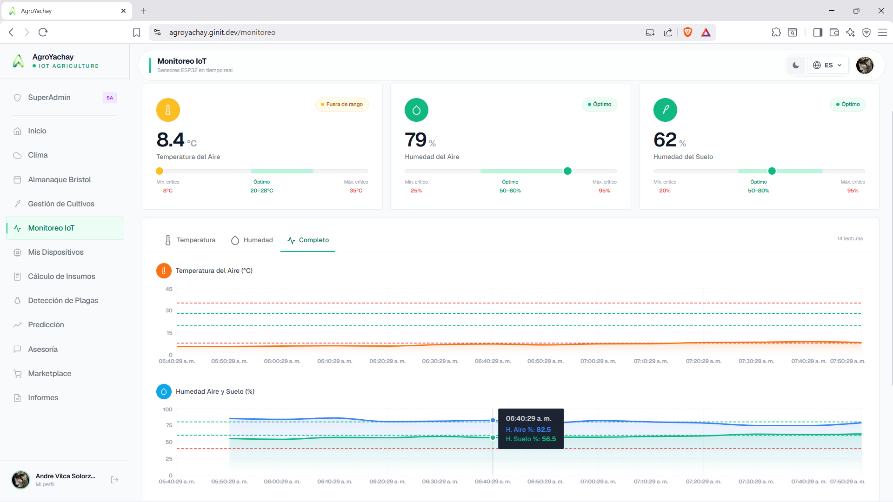
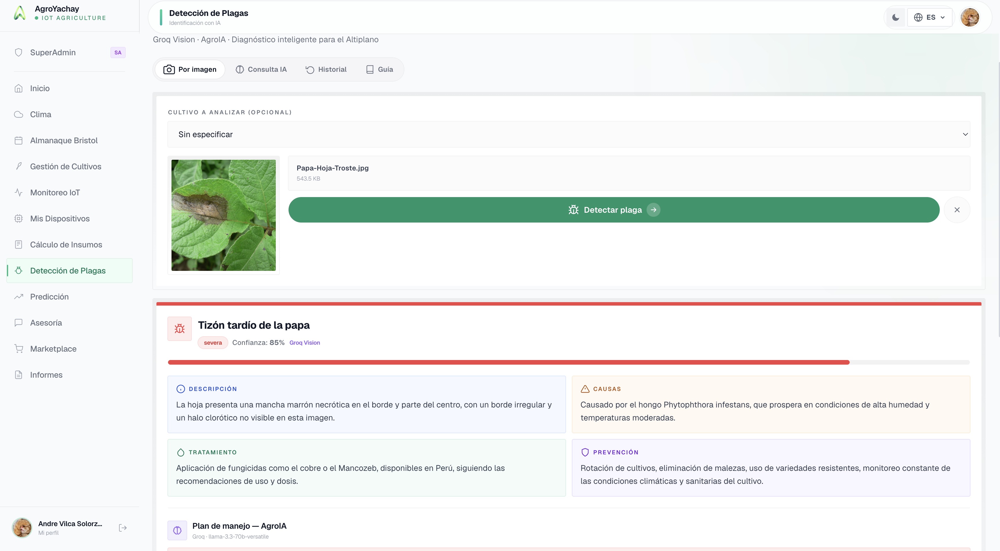
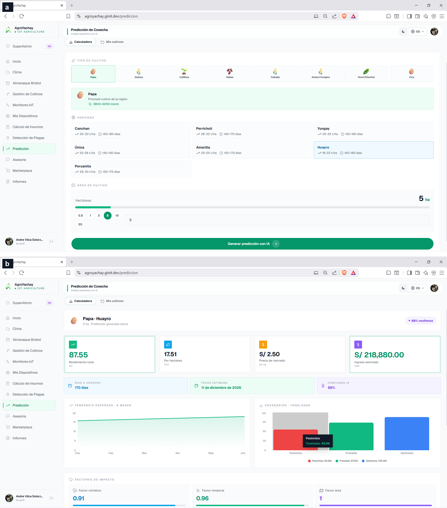

<!-- ============================================================
     HERO HEADER
     ============================================================ -->
<div align="center">


# AgroYachay

### Open-source IoT &amp; Large-Language-Model platform supporting agronomic and economic decision-making for Andean smallholders

<p>
  <a href="https://doi.org/10.5281/zenodo.20829993"></a>
  <a href="LICENSE"></a>
  <a href="https://agroyachay.ginit.dev"></a>
  
  <a href="https://github.com/Andre031222/agrocommish"></a>
</p>

<p>
  <a href="https://github.com/Andre031222/agroyachay/actions/workflows/ci.yml"></a>
  
  
  
</p>

<p align="center">
  <em>
    <b>AgroYachay</b> (<i>yachay</i> — &ldquo;knowledge&rdquo; in Quechua) turns low-cost
    <b>ESP32</b> telemetry into agronomic and economic decisions for Andean smallholders:<br>
    real-time monitoring, <b>LLM</b> pest diagnosis, conversational agronomy, and
    yield-&amp;-revenue forecasting &mdash; in a trilingual
    <b>Spanish / Quechua / Aymara</b> interface.
  </em>
</p>

<p align="center">
  <a href="https://github.com/Andre031222/agroyachay">
    
  </a>
</p>

</div>

---

## Tech stack

<div align="center">
  
  
  
  
  
  
  
  
  &nbsp;
  
  
</div>

---

## Authors

| Name | Institution |
| --- | --- |
| Fred Torres-Cruz | Universidad Nacional del Altiplano de Puno; Universidad Nacional Agraria La Molina, Lima, Peru |
| Richar Andre Vilca-Solorzano | Universidad Nacional del Altiplano de Puno, Peru |
| Dina Maribel Yana-Yucra | Universidad Nacional del Altiplano de Puno, Peru |
| Vladimiro Ibañez-Quispe | Universidad Nacional del Altiplano de Puno, Peru |
| Eduardo Leuman Fuentes-Navarro | Universidad Nacional Agraria La Molina, Lima, Peru |

**Faculty:** Ingeniería Estadística e Informática — Universidad Nacional del Altiplano (UNAP), Puno, Peru

---

## Overview

Deploying low-cost agricultural IoT is now economically feasible, but reviews of
the field consistently report that the harder, recurring gap is the *last mile*
between raw telemetry and a decision a smallholder can act on. A node reporting
"soil moisture 18 %" does not tell a Quechua-speaking potato grower at 3,800 m
whether to irrigate today, whether the leaf spots on a plant are late blight, or
whether the season will pay for its inputs.

**AgroYachay** closes that loop. It is an open-source web platform that turns
low-cost ESP32 telemetry into actionable agronomic and economic decisions for
Andean smallholders. ESP32 nodes streaming air temperature/humidity (DHT11) and
soil moisture (FC-28) feed a Flask/PostgreSQL backend and a React dashboard with
threshold alerts. A large-language-model layer (Groq) adds image-based
pest/disease diagnosis with locally available treatments, a context-aware
conversational agronomic assistant, and forecast-driven activity planning. A
transparent factor model couples crop phenology, climate and parcel area with
regional market prices to estimate yield, revenue and confidence, and the system
exports PDF/Excel reports. The interface is trilingual (Spanish, Quechua, Aymara).

AgroYachay is the cloud counterpart of the **[AgroCommish](https://github.com/Andre031222/agrocommish)**
commissioning tool, which manufactures and provisions the ESP32 nodes; together
they form an open, reproducible *device-to-decision* pipeline for low-resource
agriculture.

---

## Key Features

| Module | Function |
| --- | --- |
| Real-time monitoring | Ingests ESP32 readings, links devices to crops/users, stores time series, renders live temperature, air- and soil-humidity charts (Recharts) |
| Threshold alerts | Per-sensor configurable limits raise frost, drought and water-logging alerts |
| LLM pest/disease diagnosis | Upload a leaf photo → vision LLM returns a structured verdict (disease, confidence, severity) and a Peru-specific management plan with product doses and an organic alternative |
| Conversational agronomy | Context-aware assistant answers free-form questions conditioned on the farmer's crops, region and latest sensor values |
| Forecast planning | Turns current conditions and the 5-day OpenWeather forecast into a risk level, weekly activity plan and optimal-day recommendations |
| Yield &amp; revenue estimation | Transparent multiplicative factor model (climate × phenology × area) × regional price → projected tonnage, expected revenue and a confidence score; no training data required |
| Reporting | Executive, crop-status, financial and climate-impact reports as styled PDF (ReportLab) and Excel (OpenPyXL) |
| Trilingual UI | Runtime locale dictionaries for Spanish (`es`), Quechua (`qu`) and Aymara (`ay`) |
| Security | JWT auth (Flask-JWT-Extended) with bcrypt hashing and optional Google OAuth |

---

## Architecture

AgroYachay follows a three-tier edge–cloud architecture:

```text
ESP32 (DHT11 + FC-28)  ──WiFi/HTTP(JSON)──►  Flask 3 backend  ──►  PostgreSQL 17
   (commissioned by                          │  controllers + services
    AgroCommish)                             │  ├─ groq_service   (LLM)
                                             │  └─ weather_service (OpenWeather)
                                             ▼
                                   React 18 SPA (Tailwind + Recharts)
                                   JWT-secured REST API
```

- **Backend** — Flask 3 (~7,300 LOC): request controllers (`auth`, `sensores`,
  `cultivos`, `plagas`, `clima`, `asistente`, `superadmin`), feature route
  modules (`prediccion`, `asesoria`, `informes`, `insumos`, `marketplace`),
  SQLAlchemy models, and a service layer. State persists in PostgreSQL across
  15 normalised tables.
- **Frontend** — React 18 SPA (~13,000 LOC) with Tailwind CSS, Recharts and an
  Axios REST client.
- **External services** — Groq LLM API (intelligence layer) and OpenWeather API
  (current conditions and forecast).

---

## Screenshots

<div align="center">

<br/><sub><b>Real-time monitoring</b> — live air/soil series, KPI cards and threshold alerts</sub>
<br/><br/>

<br/><sub><b>LLM pest/disease diagnosis</b> — structured verdict + Peru-specific management plan</sub>
<br/><br/>

<br/><sub><b>Yield &amp; revenue estimation</b> — projected tonnage, expected revenue and confidence</sub>
</div>

---

## Repository Structure

```text
.
├── backend/                      # Flask 3 + SQLAlchemy + PostgreSQL
│   ├── main.py                   # app entry point (WSGI: main:app)
│   ├── controllers/              # auth, sensores, cultivos, plagas, clima, asistente, superadmin
│   ├── app/
│   │   ├── routes/               # prediccion, asesoria, informes, insumos, marketplace
│   │   ├── models/               # SQLAlchemy models
│   │   ├── services/             # groq_service, weather_service, ml_prediccion
│   │   └── utils/                # PDF/Excel reports, email
│   ├── migrations/               # SQL schema + advanced-features migrations
│   ├── scripts/setup_postgres.py # one-shot DB bootstrap (tables, indexes, admin)
│   ├── tests/                    # pytest suite
│   └── requirements.txt
├── frontend/                     # React 18 + Vite + Tailwind
│   ├── src/                      # components, pages, context, locales (es/qu/ay)
│   ├── public/
│   └── package.json
├── arduino/                      # ESP32 firmware (companion: AgroCommish)
├── HARDWARE_SETUP.md             # wiring (ESP32 + DHT11 + FC-28)
├── CITATION.cff
└── LICENSE
```

---

## Installation

Requires **Python ≥ 3.9**, **Node.js ≥ 18** and **PostgreSQL ≥ 14**.

### 1. Backend

```bash
cd backend
python -m venv .venv && . .venv/bin/activate      # Windows: .venv\Scripts\activate
pip install -r requirements.txt
cp .env.example .env                              # then fill in DB + API keys

# Bootstrap the database (tables, indexes, superadmin).
# Set ADMIN_EMAIL / ADMIN_PASSWORD first; otherwise a random password is printed.
python scripts/setup_postgres.py

python main.py                                    # serves on http://localhost:5000
```

Required environment variables (see [`backend/.env.example`](backend/.env.example)):
`DB_*`, `SECRET_KEY`, `JWT_SECRET_KEY`, `GROQ_API_KEY`, `OPENWEATHER_API_KEY`,
and optional `GOOGLE_CLIENT_ID` / `PLANT_ID_API_KEY`.

### 2. Frontend

```bash
cd frontend
npm install            # or: pnpm install
npm run dev            # development server
npm run build          # production build → frontend/build
```

Set `VITE_API_URL` (and optional `VITE_GOOGLE_CLIENT_ID`) in `frontend/.env`
(see [`frontend/.env.example`](frontend/.env.example)). For a same-origin
deployment, point the web server's `/api/*` to the backend and serve the build
statically.

### 3. Firmware

The ESP32 firmware and the full flashing/provisioning workflow are provided by
the companion tool **[AgroCommish](https://github.com/Andre031222/agrocommish)**.
Wiring is documented in [`HARDWARE_SETUP.md`](HARDWARE_SETUP.md).

---

### Production deployment

For a production setup (Gunicorn + Nginx + PostgreSQL, same-origin, HTTPS), see
**[`docs/DEPLOYMENT.md`](docs/DEPLOYMENT.md)** — the guide behind the live demo at
[agroyachay.ginit.dev](https://agroyachay.ginit.dev).

---

## Tests

```bash
cd backend && python -m pytest          # 15 tests
cd ../frontend && npm run test:run      # 13 tests (Vitest)
```

---

## Companion Ecosystem

| Project | Role | Reference |
| --- | --- | --- |
| **[AgroCommish](https://github.com/Andre031222/agrocommish)** | Manufactures and commissions ESP32 sensor nodes (detect → flash → provision → verify → activate) | [](https://doi.org/10.5281/zenodo.20655610) |
| **AgroYachay** (this repo) | Cloud decision platform: monitoring, LLM agronomy, yield/revenue, reports | [](https://doi.org/10.5281/zenodo.20829993) |

Together they form a complete open device-to-decision pipeline on commodity
hardware, with no per-seat licensing.

---

## Citation

If you use this software, please cite:

```bibtex
@software{vilca2026agroyachay,
  author  = {Torres Cruz, Fred and Vilca Solorzano, Richar Andre and
             Yana Yucra, Dina Maribel and Iba{\~n}ez Quispe, Vladimiro and
             Fuentes Navarro, Eduardo Leuman},
  title   = {AgroYachay: An open-source IoT and large-language-model platform
             supporting agronomic and economic decision-making for Andean smallholders},
  year    = {2026},
  version = {1.0.0},
  doi     = {10.5281/zenodo.20829993},
  url     = {https://github.com/Andre031222/agroyachay}
}
```

Citation metadata is also available in [`CITATION.cff`](CITATION.cff)
(GitHub: "Cite this repository").

---

## License

This project is licensed under the [MIT License](LICENSE).

<div align="center">
<sub>Built for Andean smallholder agriculture · Universidad Nacional del Altiplano (UNAP), Puno, Peru</sub>
</div>
